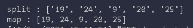
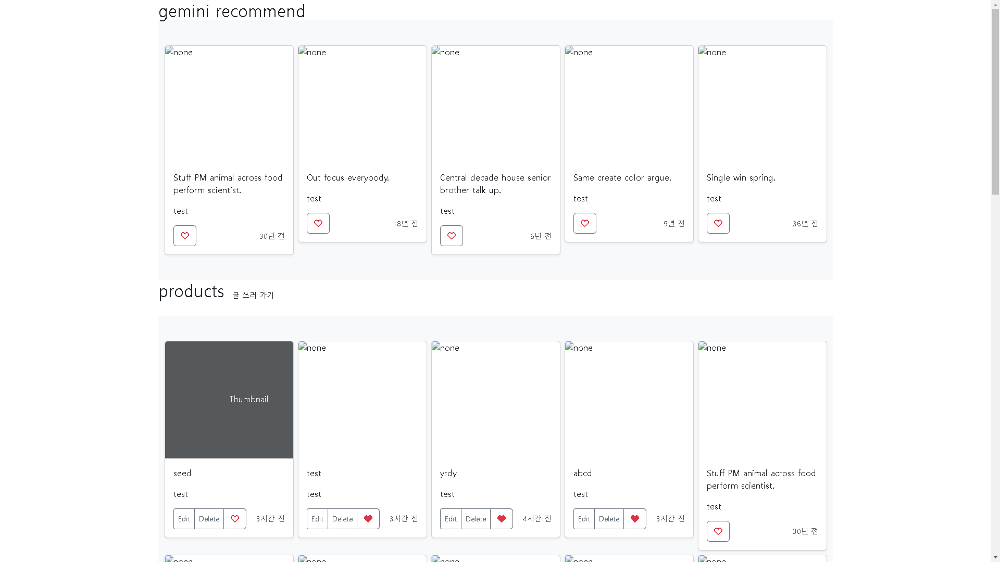
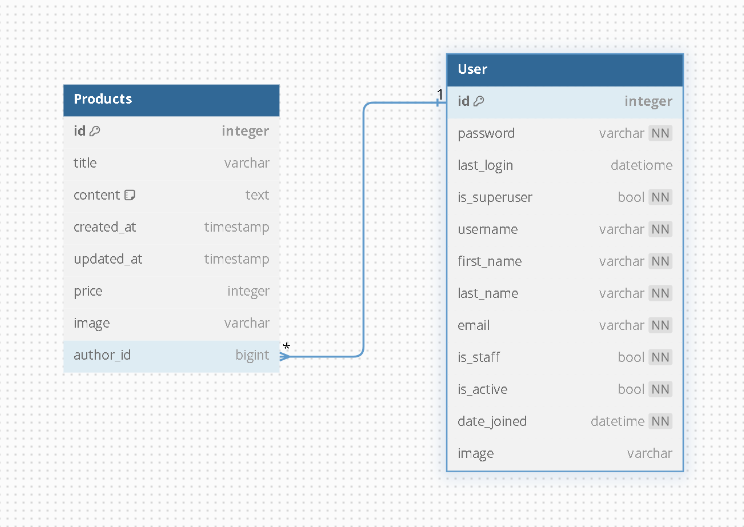

# GeminiLLMPjt
## Development Perion
- 2024.09.05 ~ 2024.09.10
## Project Introduction
**Using AI API to Recommend and Prioritize Products**

We utilize an AI API to receive product recommendations and display these recommended products at the top of the page. 

To ensure personalized recommendations, we consider various factors
* **Likes:** The number of likes a product has received.
* **User post count:** The total number of posts created by the user.
* **Follow count:** The number of users following the user.

By taking these factors into account, we are able to provide highly relevant product suggestions to each individual user.
## 💻 Development Environment
|Programming Language| python 3.10|
|:----------------:|:----------------:|
| Web Framework | Django 4.2|
| Database | SQLite|
| IDE | Vs code |
| Version Control | Git, Github |
| Backend | Python, Django |
| Frontend | HTML, CSS, Bootstrap, JS |
| Database | Django ORM, SQLite |
| LLM | Gemini AI API |

## Gemini api
### [get api key](https://aistudio.google.com/app/apikey?hl=ko)
make api key and input at API_KEY

[how to use Gemini API](https://ai.google.dev/gemini-api/docs/get-started/tutorial?lang=swift&hl=ko#set-up-project)


### how to call Gemini ai api
```python
# hide api key
from . import config
API_KEY = config.GOOGLE_API_KEY

# call ai api
import google.generativeai as genai
from IPython.display import display, Markdown
def Get_Answer(query):
    genai.configure(api_key=API_KEY)

    model = genai.GenerativeModel("gemini-1.5-flash")
    response = model.generate_content(f"write question")
    return response.text
```

### gemini recommend product



api recommend 5 products and display recommended products




## ERD Diagram
[Gemini_LLM_ERD](https://dbdiagram.io/d/SpartaLLMProject-66d9d8eceef7e08f0ed1d09a)
